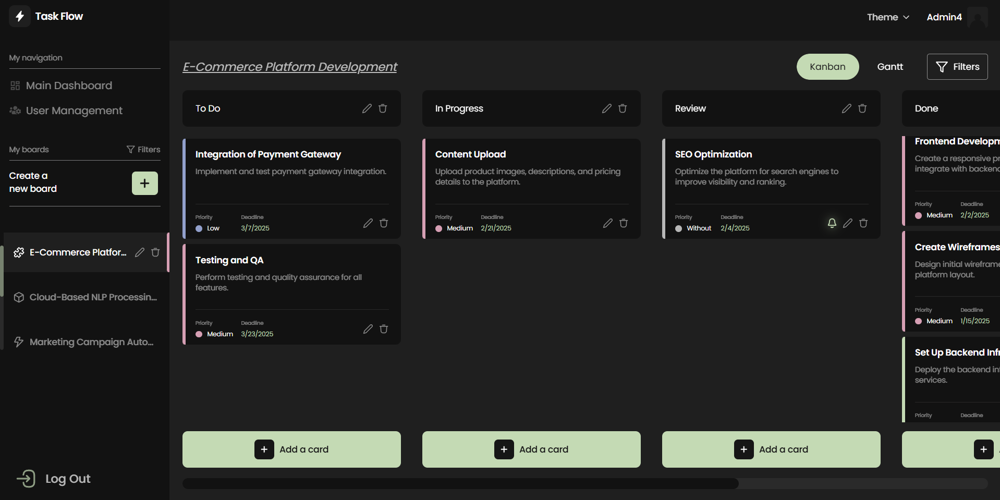
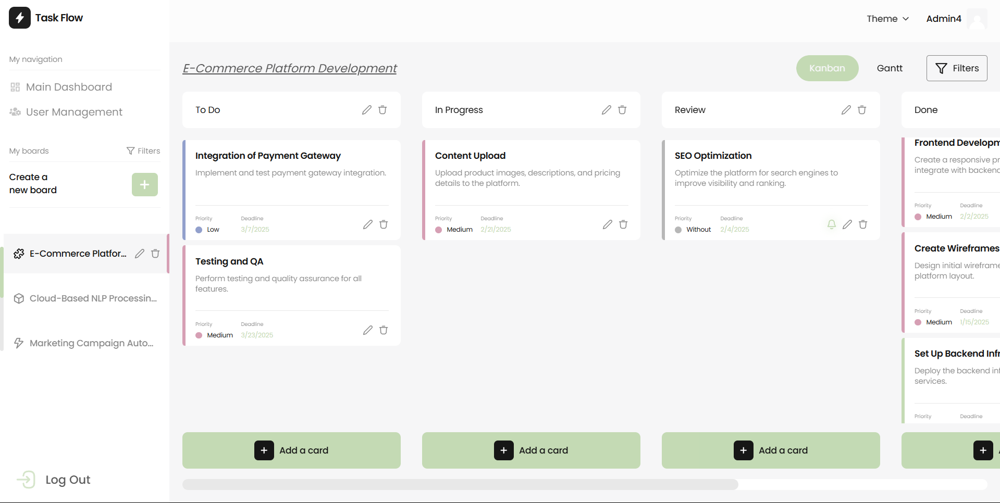

# **Mini Project Management Tool** 🎯

_A scalable and intuitive project management tool designed to help teams efficiently create, assign, and track tasks across multiple projects. Featuring real-time updates, role-based access control (RBAC), and an interactive Kanban board with drag-and-drop functionality, this tool ensures seamless collaboration, improved productivity, and better project visibility. With light and dark mode support, a responsive design for all devices, and smooth task management, teams can stay organized and work efficiently anytime, anywhere._

🚀 **Deployed Demo:** [Task Flow on Vercel](https://task-flow-eight-tau.vercel.app)  
📖 **Mock API (JSON Server):** [TaskFlow API on Render](https://taskflow-6ok6.onrender.com/)

---

- **Dark Mode**

  

- **Light Mode**

  

---

## 🎯 **Features**

### ✅ **User Management**

- Users can **register and log in** using a **mock API**.
- **Role-based access control (RBAC)** with three user roles:
  - **Admin**: Can manage users, projects, and tasks.
  - **Project Manager**: Can create, update, and delete projects, manage tasks.
  - **Team Member**: Can view and update assigned tasks.
- **Admins can perform CRUD operations on users** (create, read, update, delete).

### ✅ **Project Management**

- **Admins and Project Managers can create, update, and delete projects**.
- Each project includes:
  - **Title and Description**.
  - **Start and End Dates**, with **date pickers** for selection.
  - **Assigned Team Members**, supporting **multi-selection**.
  - **Project Status**, with predefined states: **Planned, In Progress, Completed**.

### ✅ **Task Management**

- **Projects contain tasks**, which can be managed with full CRUD functionality.
- Each task includes:
  - **Title and Description**.
  - **Assigned Team Member**.
  - **Task Status**, with states: **To Do, In Progress, Done**.

### ✅ **Kanban Board**

- **Visual representation of tasks** within a project using a **Kanban board**.
- **Drag-and-drop functionality** to seamlessly update task statuses.

### ✅ **Notifications**

- **Real-time notifications** for task assignments and updates.

### ✅ **Filtering and Sorting**

- **Filter projects and tasks** by:
  - **Status** (Planned, In Progress, Completed).
  - **Priority**.
  - **Assigned Members**.

### ✅ **Polished UI/UX & Theming**

- **Responsive** design with a clean and intuitive UI.
- **Dark and Light Mode** support for accessibility.
- **Tooltips, modals, and validation messages** for improved user experience.

### ✅ **Dashboard & Reporting**

- **Centralized dashboard** displaying:
  - **Total Projects**.
  - **Total Tasks**.
  - **Task status distribution**, visualized with **charts**.

### ✅ **Progress Tracking (Gantt Chart)**

- **Gantt chart visualization** for tracking project timelines and deadlines.

### ✅ **Deployment**

- The project is **deployed** to a cloud platform (**Vercel, **).

---

## 🛠 **Tech Stack**

### **Frontend**

- ⚛️ React.js + TypeScript
- 🎨 Tailwind CSS / SCSS
- 🏗 Zustand (State Management)
- 🔄 React Query (API caching)

### **Backend**

- 🛠 JSON Server + JSON Server Auth (Mock API)

### **Tools & Deployment**

- 🚀 Vercel (Frontend)
- ☁️ Render (Mock API)

---

## 🚀 **Installation & Setup**

### **1️⃣ Clone the Repository**

```bash
git clone https://github.com/MykhailoMatsyshyn/TaskFlow.git
cd TaskFlow
```

### **2️⃣ Install Dependencies**

```bash
npm install
```

### **3️⃣ Run Backend (Mock API on JSON Server)**

```bash
npm run server
```

### **4️⃣ Run Frontend**

```bash
npm start
```

💡 By default, the app runs on `http://localhost:5173` and the API on `http://localhost:3000`.

---

## 🔑 **Test User Credentials**

To test the platform from different user roles, use the following demo credentials:

| **Role**            | **Email**                   | **Password**   |
| ------------------- | --------------------------- | -------------- |
| **Admin**           | `peter.parker@taskflow.com` | `TaskFlow2025` |
| **Project Manager** | `rick.sanchez@gmail.com`    | `TaskFlow2025` |
| **Team Member**     | `mario.bros@gmail.com`      | `TaskFlow2025` |

---

## 🏗 **Architecture & Scalability**

### **Folder Structure**

```
/src
  ├── /api             # API services for authentication, projects, tasks, users
  ├── /assets          # Static assets like images, icons, and avatars
  ├── /components      # Reusable UI components and feature-based modules
  ├── /constants       # Application-wide constants (API endpoints, statuses)
  ├── /hooks           # Custom React hooks for managing state and side effects
  ├── /pages           # Page-level components for routing and views
  ├── /routes          # Route protection and navigation logic
  ├── /stores          # Zustand-based global state management
  ├── /styles          # Global styles, themes, and animations
  ├── /types           # TypeScript type definitions for data models
  ├── /utils           # Utility functions for formatting and calculations
  ├── /validation      # Form validation schemas using Yup
```

## **Scalability Considerations**

- **Component-based architecture** for reusability.
- **Custom Hooks** to avoid prop drilling.
- **Role-Based Access Control (RBAC)**.
- **WebSockets for real-time updates**.
- **Lazy loading & code splitting** for performance.

---

## ⚡ **Performance Optimizations**

✅ **React Query** for caching API calls to reduce redundant requests.  
✅ **Lazy Loading & Code-Splitting** with `React.lazy()` & `Suspense`.  
✅ **Parallel Data Fetching** using `Promise.all()` to speed up API requests.  
✅ **Memoization** using `useCallback`, `useMemo` to optimize re-renders.  
✅ **Optimistic UI Updates** for a seamless user experience.

---

## 🎨 **UI/UX Enhancements**

✅ **Smooth Animations** with **Framer Motion** for transitions and interactions.  
✅ **Interactive Tooltips** to improve user guidance and clarity.  
✅ **Responsive Design** using **flexbox, grid, and media queries**.  
✅ **Form Validation** with **Yup + React Hook Form** for structured input.  
✅ **Dark & Light Mode** via **Tailwind CSS and CSS variables**.

---
